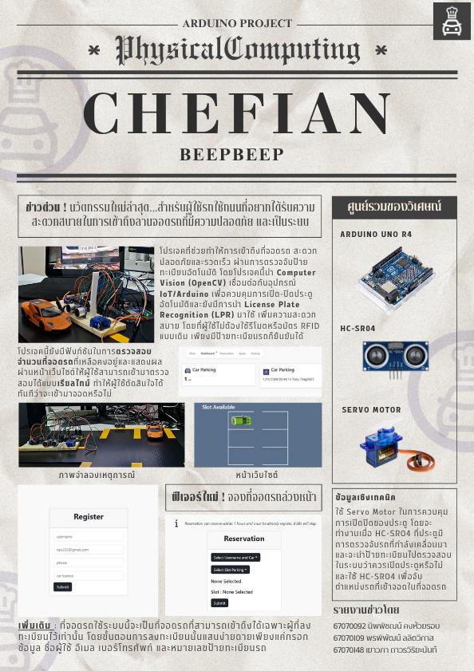

# Physical Computing Project 2025 - IT KMITL

### Project
เป็นโปรเจคที่ช่วยทำให้การเข้าถึงที่จอดรถ สะดวก ปลอดภัย และรวดเร็ว ผ่านการตรวจจับป้ายทะเบียนอัตโนมัติ โดยโปรเจคนี้นำ Computer Vision (OpenCV) และ ภาษา Python มาทำงานร่วมกับการเชื่อมต่อกับอุปกรณ์ IoT/Arduino เพื่อควบคุมการเปิด-ปิดประตูอัตโนมัติ มีการนำ License Plate Recognition (LPR) มาใช้เพื่อการควบคุมการเข้าถึงโดยตรง เพิ่มความสะดวกสบาย โดยที่ผู้ใช้ไม่ต้องใช้รีโมตหรือบัตร RFID แบบเดิม แค่ป้ายทะเบียนรถก็เพียงพอในการยืนยันตัวตน และโปรเจคนี้มีฟังก์ชันในการตรวจสอบจำนวนที่จอดรถที่เหลืออยู่ และแสดงผลผ่านหน้าเว็บไซต์ให้ผู้ใช้สามารถเข้ามาตรวจสอบได้แบบเรียลไทม์ ทำให้ผู้ใช้ตัดสินใจได้ทันทีว่าจะขับรถเข้ามาจอดหรือไม่ และยังสามารถจองที่จอดรถล่วงหน้าได้เพื่อช่วยให้ผู้ใช้ได้วาแผนการจอดรถได้ล่วงหน้า

### Objective

- เพื่อแก้ปัญหาการเปิด-ปิดประตูที่ยุ่งยาก
- เพื่อให้การเข้าถึงที่จอดรถ สะดวก ปลอดภัย และรวดเร็ว
- เพื่อวางแผนการจอดรถได้ล่วงหน้า
- เพื่อช่วยลดปัญหาการแย่งที่จอดรถ
- เพื่อให้เป็นประโยชน์ต่อผู้ดูแลลานจอดในการบริหารจัดการพื้นที่

### Contributor
| Student ID | Name | Duty | Profile |
|--|--|--|--|
| 67070092 | นายนิพพิชฌน์ คงห้วยรอบ | Arduino ORC | |
| 67070109 | นายพรพิพัฒน์ ลลิตวิภาส |OpenCV Arduino |  |
| 67070148 | นางสาวเยาวภา ถาวรวิริยะนันท์ | Web |  |

## Tools
| Arduino Uno R4 | HC-SR04 | Servo Motor |
|--|--|--|
|  |  |  |

## Poster

## Source
- https://www.youtube.com/watch?v=DF7A-Sq3MlU
- OpenCV with Python https://pypi.org/project/opencv-python/
- Servo Motor Basics with Arduino https://docs.arduino.cc/learn/electronics/servo-motors/
- Arduino 4 Relays Shield Basics https://docs.arduino.cc/tutorials/4-relays-shield/4-relay-shield-basics/
- What is Inference? https://inference.roboflow.com
- Introductiov ultralytics https://docs.ultralytics.com
- Ultralytics https://www.ultralytics.com
- Model Prediction with Ultralytics YOLO https://docs.ultralytics.com/modes/predict/
- os — Miscellaneous operating system interfaces https://docs.python.org/3/library/os.html

